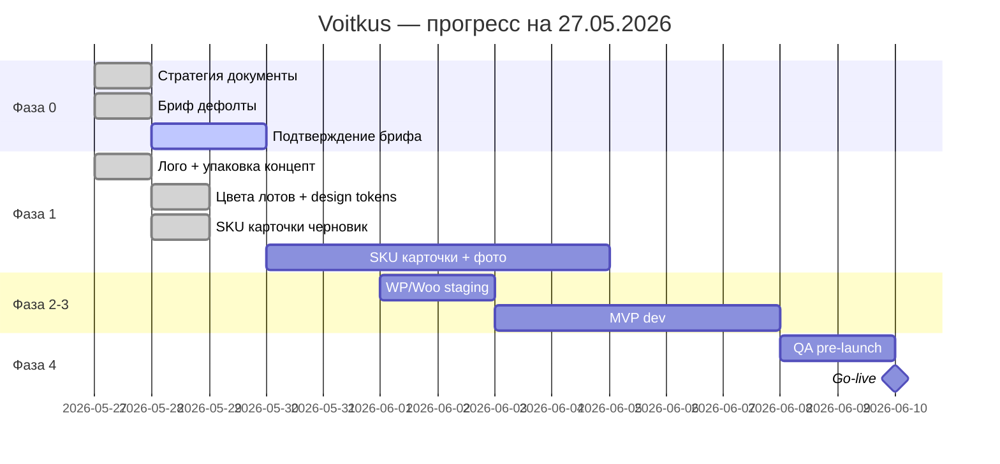

# Voitkus Coffee Roastery — Roadmap

**Старт:** 2026-05-27 · **Дедлайн:** 2026-06-10 · **Сегодня:** 27.05.2026 · **Осталось:** 14 дней

---

## Статус выполнения (сводка)

| | |
|---|---|
| **Общий прогресс до go-live** | **~58%** |
| **Текущая фаза** | **1.5 — HTML/CSS прототип** (согласование дизайна) |
| **Следующий критичный шаг** | Открыть `prototype/` → правки → «ок» → перенос в WP |

### Прогресс по фазам

| Фаза | Название | % | Статус |
|------|----------|---|--------|
| **0** | Стратегия + бриф | **95%** | ✅ ждёт подтверждения основателя |
| **1** | Визуал (лого, упаковка) + контент | **65%** | 🟡 SKU + цветовая v2 |
| **1.5** | **Прототип HTML** | **70%** | 🟡 `prototype/` — 6 страниц |
| **2** | Техбаза WP/Woo | **40%** | ⏸ после «ок» прототипа |
| **3** | MVP разработка | **15%** | ⏸ тема ждёт утверждения UI |
| **4** | QA + запуск 10.06 | **0%** | ⬜ не начата |
| **5** | Рост (после запуска) | — | ⬜ после 10.06 |

### Что уже сделано ✅

| Артефакт | Документ / assets |
|----------|-------------------|
| Позиционирование, аудитории, tone, messaging | `01`–`05` |
| Карта контента MVP | `08` |
| Бриф с рабочими дефолтами (PL, InPost, P24…) | `09` |
| История бренда v1 | `06` |
| **Логотип** (VOITKUS + roast curve, 4 точки) | `11-logo.md`, assets |
| **Система упаковки** (чёрный пакет + color-per-lot, 6 цветов) | `10-packaging-system.md`, assets |
| Визуальный бриф от упаковки | `07` |
| Дедлайн запуска | 10.06.2026 |

### Блокеры сейчас 🔴

1. Дефолты в `09` **не подтверждены** (имя, домен, email, цены)
2. **Нет** финальных SVG лого / print PDF пачек
3. **Локально:** тема готова; **прод:** домен/хостинг не подключены
4. **Нет** фото пачек (5 SKU)
5. NUTKI/цены — черновик, нужен cupping

---

## Обзор фаз (актуальный Gantt)

| Фаза | Срок | Результат | Статус |
|------|------|-----------|--------|
| **0** | 27.05–29.05 | Стратегия + бриф без блокеров | 🟡 90% |
| **1** | 28.05–05.06 | Лого/пачки финал, 4–5 SKU, тексты | 🟡 45% |
| **2** | 01.06–02.06 | Staging WP/Woo | ⬜ 0% |
| **3** | 03.06–07.06 | MVP магазин | ⬜ 0% |
| **4** | 08.06–10.06 | QA + go-live | ⬜ 0% |
| **5** | с 11.06 | Подписка, SEO, B2B | ⬜ |

---

## Фаза 0 — Стратегия + бриф (90%)

### Документы стратегии

| Задача | Статус | Документ |
|--------|--------|----------|
| Позиционирование и УТП | ✅ v1 | [01-positioning.md](./01-positioning.md) |
| Аудитории и персоны | ✅ v1 | [02-audience-personas.md](./02-audience-personas.md) |
| Tone of voice | ✅ v1 | [03-tone-of-voice.md](./03-tone-of-voice.md) |
| Продуктовая архитектура | ✅ v1 | [04-product-architecture.md](./04-product-architecture.md) |
| Messaging / копирайт | ✅ v1 | [05-messaging-copy.md](./05-messaging-copy.md) |
| Карта контента сайта | ✅ v1 | [08-website-content-map.md](./08-website-content-map.md) |
| Согласование `01` + `05` с основателем | ⬜ | — |

### Бриф и решения

| Задача | Статус |
|--------|--------|
| `09` критичные #1–10 (дефолты) | ✅ черновик |
| `09` #25 дедлайн 10.06.2026 | ✅ |
| `06` brand story v1 | ✅ черновик |
| Подтвердить дефолты (цены, имя, домен, контакты) | ⬜ |
| Референсы конкурентов (#11, #14) | ⬜ |
| Финал `01` v1.1 после подтверждения | ⬜ |

**Exit фазы 0:** основатель подтвердил бриф + «ок» на тексты позиционирования.

---

## Фаза 1 — Визуал + контент (45%)

### Визуал и бренд

| Задача | Статус | Документ |
|--------|--------|----------|
| Направление визуала (packaging-led) | ✅ | [07-visual-direction-brief.md](./07-visual-direction-brief.md) |
| Логотип (концепт) | ✅ | [11-logo.md](./11-logo.md) |
| Система упаковки (6 цветов) | ✅ | [10-packaging-system.md](./10-packaging-system.md) |
| Назначить цвет каждому лоту MVP | ✅ черновик | `10`, `12` |
| Design tokens (CSS) | ✅ | `design-tokens.css` |
| Карточки 5 SKU (тексты PL) | ✅ черновик | `12-mvp-products.md` |
| Logo kit SVG/PNG/favicon | ⬜ | экспорт |
| Print-ready PDF пачек 250g | ⬜ | печать |
| UI kit для сайта (Figma) | ⬜ | black + `--lot-accent` |
| 1 kg макет | ⬜ | |
| Social templates | ⬜ | |

### Продукт и контент

| Задача | Статус |
|--------|--------|
| 4–5 лотов обжарены и названы | ⬜ |
| Карточки (происхождение, NUTKI, 4 колонки) | ⬜ |
| Фото пачек (6 цветов / активные SKU) | ⬜ |
| Фото обжарки / основателя | ⬜ |
| Таблица цен и остатков | ⬜ |
| Legal PL (RODO, regulamin, dostawa) | ⬜ |
| Instagram буфер 6+ постов | ⬜ |

**Exit фазы 1:** цвета назначены + 4–5 SKU с фото + UI kit → можно в вёрстку.

---

## Фаза 2 — Техбаза (0%)

| Задача | Статус |
|--------|--------|
| Домен + DNS | ⬜ |
| Хостинг PHP 8.2+ | ⬜ |
| WordPress + WooCommerce | ⬜ |
| Staging | ⬜ |
| SMTP, analytics, RODO cookie | ⬜ |
| Плагины: P24, InPost, ACF, SEO, cache | ⬜ |

**Exit:** тестовый заказ на staging.

---

## Фаза 3 — MVP сайт (0%)

Scope без изменений → [08-website-content-map.md](./08-website-content-map.md)

| Задача | Статус |
|--------|--------|
| Вёрстка black + accent лота | ⬜ |
| Каталог + фильтры everyday/espresso/funky | ⬜ |
| Карточка: вес × помол, дата обжарки, ACF | ⬜ |
| Главная, About, Contact, B2B | ⬜ |
| Checkout + P24 + InPost | ⬜ |
| Legal 3 страницы | ⬜ |
| Favicon, OG, SEO schema | ⬜ |

**Exit:** 5 тестовых заказов на staging.

---

## Фаза 4 — QA и запуск 10.06 (0%)

| Задача | Статус |
|--------|--------|
| Pre-launch checklist | ⬜ |
| Production + live keys | ⬜ |
| Тестовый заказ → refund | ⬜ |
| Launch day (IG, мониторинг) | ⬜ |

**Exit:** ≥1 оплаченный B2C заказ.

---

## Фаза 5 — Рост (после 10.06)

| Инициатива | Приоритет |
|------------|-----------|
| Подписка B2C | P1 |
| Brew guides | P1 |
| EN язык | P2 |
| B2B прайс / кабинет | P2 |
| EU доставка | P3 |

---

## Календарь до запуска (факт + план)

| Дата | План | Статус | Факт / что осталось |
|------|------|--------|---------------------|
| **27.05** | Бриф + старт визуала | 🟡 | Документы `01–11`, дефолты в `09`, лого и пачки зафиксированы. Осталось: подтверждение брифа |
| **28.05** | Story финал + цвета лотов | 🟡 | Цвет→лот, `12` SKU, `design-tokens.css`. Осталось: подтверждение |
| **29.05** | SVG лого + UI kit v1 | ⬜ | Экспорт `11`, Figma для сайта |
| **30.05** | 4–5 SKU описания + цены | ⬜ | Таблица лотов, тексты карточек |
| **31.05** | Фотосессия пачек | ⬜ | Минимум 1 кадр на активный SKU |
| **01.06** | WP/Woo staging | ⬜ | Хостинг, домен |
| **02.06** | Каталог + product page | ⬜ | Вариации, ACF |
| **03.06** | Главная + About + B2B | ⬜ | |
| **04.06** | Checkout + оплата + dostawa | ⬜ | |
| **05.06** | Legal + SEO | ⬜ | |
| **06.06** | Контент-заливка | ⬜ | |
| **07.06** | Mobile QA | ⬜ | |
| **08.06** | Pre-launch | ⬜ | |
| **09.06** | Prod test order | ⬜ | |
| **10.06** | **GO LIVE** | ⬜ | |

---

## Action list — ближайшие 3 дня

### 28.05 (завтра)
1. Подтвердить или поправить дефолты в `09` (цены, имя, домен, email).
2. Заполнить таблицу **цвет → лот** в `10-packaging-system.md`.
3. Дать «ок» на `01` + `05` (одним сообщением).

### 29.05
4. Экспорт лого SVG/PNG + favicon.
5. UI kit v1: чёрный фон, карточка с `--lot-accent`.
6. Выбрать хостинг + домен (или подтвердить voitkuscoffee.com).

### 30.05
7. Тексты 4–5 карточек товара (по шаблону этикетки).
8. Старт WP staging (если домен готов).

---

## Риски (актуально)

| Риск | Уровень | Митигация |
|------|---------|-----------|
| Дедлайн 10.06 при 0% dev | 🔴 высокий | 01.06 staging обязателен; урезать scope (без brew blog) |
| Дефолты брифа не те | 🟡 | Подтвердить 28.05 |
| Цвета не привязаны к лотам | 🟡 | Сделать 28.05 |
| Нет фото к 31.05 | 🟡 | Съёмка на телефон, нейтральный фон |
| Нет print PDF | 🟢 | MVP онлайн не блокирует; стикер временно |

---

## KPI

| Метрика | Цель | Сейчас |
|---------|------|--------|
| Документы бренда | 11 файлов | ✅ 11/11 |
| Лого + упаковка концепт | утверждено | ✅ концепт / ⬜ экспорт |
| SKU ready с фото | 4–5 | 0 |
| Staging + тест заказ | 1 | 0 |
| Go-live | 10.06 | ⬜ |

---

## Связанные документы

- [README.md](./README.md)
- [09-open-questions.md](./09-open-questions.md)
- [10-packaging-system.md](./10-packaging-system.md)
- [11-logo.md](./11-logo.md)
- [08-website-content-map.md](./08-website-content-map.md)

**Версия roadmap:** v1.4 · обновлено 2026-05-28
